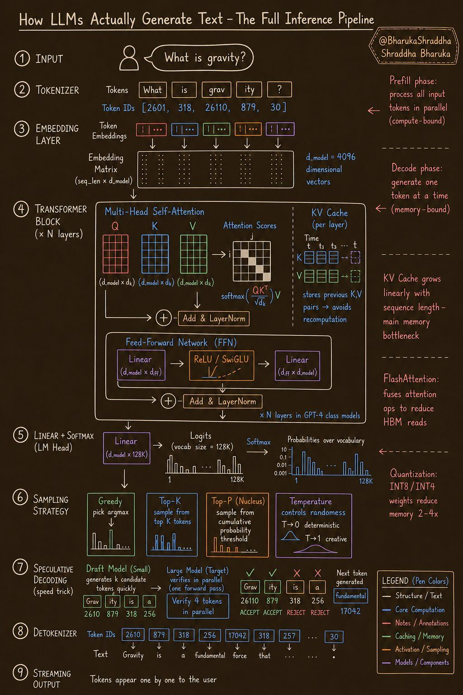

> [!summary]  
> A comprehensive breakdown of the modern **Transformer-based LLM inference pipeline**. The process is split into a parallel, compute-bound **Prefill Phase** and a sequential, memory-bound **Decode Phase**, heavily relying on critical production optimizations like **KV Caching**, **Quantization**, and **Speculative Decoding** to function efficiently in real-world applications.

### Phase 1: The Prefill Phase (Compute-Bound)
When you hit "send," the entire prompt is processed at once in parallel.

**1. Input**
- **What happens:** The user submits a raw text prompt (e.g., "*What is gravity?*").
**2. Tokenizer**
- **What happens:** The LLM doesn't read text; it reads numbers. The tokenizer chops the raw text into smaller chunks called "tokens" (which can be words, parts of words, or single characters).
- **Token IDs:** Each unique token is mapped to a specific integer ID from the model's fixed vocabulary dictionary.
    - _Example:_ "gravity" becomes two tokens: "grav" (26110) and "ity" (879).
**3. Embedding Layer**
- **What happens:** The discrete Token IDs are converted into continuous, high-dimensional arrays of numbers called "embeddings" (often 4,096 dimensions or more).
- **Why it matters:** These vectors capture the semantic meaning of the token. Words with similar meanings will have vectors that are mathematically closer together in this high-dimensional space.
### Phase 2: The Core Processing

**4. Transformer Block (The Engine)**
The embeddings pass through multiple identical Transformer layers sequentially. This is where the model "understands" context.

- **Multi-Head Self-Attention:** This mechanism allows every token to "look" at every other token in the sequence to understand context (e.g., knowing that "bank" means a river bank instead of a financial institution based on surrounding words).
    - It creates three vectors for each token: **Q**ueries (what am I looking for?), **K**eys (what do I contain?), and **V**alues (what is my actual meaning?).
    - The attention scores are calculated using the formula: 
		$$ \text{softmax}\left(\frac{QK^T}{\sqrt{d_k}}\right)V $$
        
- **KV Cache:** _Crucial for speed._ Because generating text happens one word at a time, calculating the Key and Value matrices for the whole prompt over and over would be incredibly slow. The KV Cache stores the past K and V states in memory. This is the primary memory bottleneck in modern LLMs.
- **Feed-Forward Network (FFN):** After tokens share information via attention, the FFN applies non-linear transformations (using activation functions like ReLU or SwiGLU) to each token individually, effectively "thinking" about the new context-enriched representation.
- **Add & LayerNorm:** These steps stabilize the mathematical outputs between layers to ensure the neural network doesn't collapse during training and inference.
    

### Phase 3: The Decode Phase (Memory-Bound)
Now the model must predict the _next_ token. This happens sequentially (one token at a time).

**5. Linear + Softmax (LM Head)**
- **What happens:** The final vector emerging from the last Transformer layer is projected by a Linear layer into a massive list of numbers called "logits." There is one logit for every single word in the model's vocabulary (e.g., 128,000 logits).
- **Softmax:** A mathematical function converts these raw logits into a probability distribution between 0 and 1. The percentages of all 128,000 possible next tokens will sum up to 100%.

**6. Sampling Strategy**
- **What happens:** The model must choose the next token based on the probabilities. It doesn't always pick the #1 most likely word, as that can make the text sound robotic.
- **Methods:**
    - **Greedy:** Always picks the highest probability (good for coding or math).
    - **Top-K / Top-P (Nucleus):** Restricts the selection pool to only the top $K$ most likely tokens, or the top tokens whose combined probabilities add up to $P$. It randomly samples from this restricted pool to inject natural-sounding creativity.
    - **Temperature:** A multiplier that adjusts the probabilities before sampling. A low temperature ($T \to 0$) makes the highest probability dominate (deterministic). A high temperature ($T \to 1$) flattens the distribution, making less likely words more possible (creative).
**7. Speculative Decoding (Speed Optimization)**
- **What happens:** Large models are slow. In this optional optimization, a smaller, "cheaper" draft model quickly guesses the next few tokens (e.g., "fundamental force that").
- **Verification:** The large model then takes that whole drafted sequence and verifies it in a _single parallel pass_. If the large model agrees with the draft, it accepts the tokens, effectively generating multiple tokens in the time it usually takes to generate one. If it disagrees, it rejects them and generates the correct token itself.
**8. Detokenizer**
- **What happens:** The chosen token ID (e.g., 17042) is mapped back to its human-readable text string (e.g., "fundamental").
**9. Streaming Output**
- **What happens:** The newly generated text is sent to the user interface. The new token is then appended to the original prompt, and the entire Decode Phase (from step 4) loops again to generate the _next_ token, creating the typing effect you see on screen.