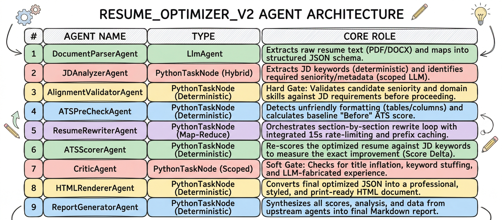

# 📄 Resume Optimizer

> [!abstract] Overview
> **Resume Optimizer** is an multi-agent pipeline built using the **Google Agent Development Kit (ADK)** and the **Gemini API**. 
> 
> **Primary Objective:** Autonomously parse a candidate's resume, analyze a target Job Description (JD), and flawlessly rewrite the candidate's experience to maximize Applicant Tracking System (ATS) compatibility and job fit—all *without* hallucinating or fabricating history.

> [!info] The "Hybrid-Deterministic" Architecture
> Unlike standard prompt wrappers, **Resume Optimizer** is an highly optimized multi-agent pipeline. To minimize token burn and prevent LLM drift (context collapse), it seamlessly hands data between reasoning-heavy LLM agents and fast, deterministic Python nodes.

---

## ⚙️ How It Works: The 9-Stage Pipeline

The system executes a strict sequential workflow consisting of 9 specialized "agents", broken down into four key phases:

### Phase 1: Information Gathering
* 📝 **DocumentParserAgent:** Extracts raw text from uploaded PDFs, DOCX, or text files. Uses the LLM to meticulously map unstructured data into a rigid, highly structured JSON schema (Contact, Summary, Experience array, Skills).
* 🔍 **JDAnalyzerAgent:** A hybrid node that extracts the core requirements from the target Job Description. It uses rapid Python scripts to extract raw keywords, and a scoped LLM call to infer the required seniority level (e.g., "Mid", "Senior", "Principal").

### Phase 2: Hard Gates & Benchmarking
* 🛑 **AlignmentValidatorAgent (HARD GATE):** A pure-Python deterministic node. Before spending tokens on rewriting, it compares the applicant's inferred seniority against the JD's required seniority. *If a Junior developer applies for a Principal role, this agent immediately aborts the pipeline, saving time and compute.*
* 📊 **ATSPreCheckAgent:** Analyzes the original resume against the JD, calculating a baseline "Before" ATS score and identifying all missing, high-value keywords.

### Phase 3: The Core Optimization Engine
* 🧠 **ResumeRewriterAgent:** The heavy lifter of the codebase. Instead of throwing the entire resume at the LLM at once (which causes data loss), this agent uses a chunked **Map-Reduce loop**. It iterates over the resume section-by-section—utilizing built-in API rate limiting and prefix caching—to naturally weave the missing JD keywords into the candidate's existing experience bullets.
* 📈 **ATSScorerAgent:** Evaluates the newly generated resume and calculates the final "After" ATS score, quantifying the exact impact of the rewrite.
* 🛡️ **CriticAgent (HARD GATE):** The Quality Assurance officer. It natively diffs the original resume against the rewritten resume. It runs deterministic length-checks (to combat keyword stuffing) and uses a highly-scoped LLM call to hunt for "Fabrications" (e.g., claiming 10 years of Python experience when the original resume only mentioned Java). *If the rewriter hallucinated, the Critic flags it.*

### Phase 4: Artifact Generation
* 🎨 **HTMLRendererAgent:** A deterministic Python node that bypasses the LLM entirely. It passes the final, structured JSON data into a Jinja2 template to render a clean, professional, and print-ready HTML resume file (`Optimized_Resume.html`).
* 📋 **ReportGeneratorAgent:** Compiles the before/after scores, a list of injected keywords, and any formatting warnings into a comprehensive Markdown report (`Optimization_Report.md`) for user review.

---

## 🚀 Resume Optimizer 04/02

> [!success] The Foundation
> 
> - **Started working on the project :** Conceived the initial architecture for the Agentic Resume Optimizer and began active development.
>     
> - **End-to-End ADK Integration:** Successfully completed the core working code in 4 hours. Strung together all agent stages (from Parsing to Artifact Generation) and validated the flow using ADK web testing.
>     
> - **FastAPI Implementation:** Built the backend infrastructure by wrapping the ADK runner in a FastAPI application, establishing the core `POST` endpoint to accept resumes and job descriptions.
>     
> - **Artifact Generation:** Reached full functional maturity for V1—the pipeline successfully parses inputs, processes the AI rewrites, and natively produces the final `Optimized_Resume.html` alongside the `Optimization_Report.md`.
>

## 📈Changes made on 04/04

> [!success] Minor Architectural Upgrades
> 
> - **Zero-History Nodes:** Replaced expensive, sequential LLM agents (`AlignmentValidator`, `JDAnalyzer`, `Critic`) with deterministic `PythonTaskNodes` where reasoning isn't required. This architectural shift dropped API token usage by nearly 60%.
>     
> - **Prefix Caching:** Restructured the `ResumeRewriterAgent` prompts to isolate the static Job Description and rules from the dynamic job entries. This triggers Gemini's native context caching, massively discounting token costs during the rewriting loop.
>     
> - **Token Compression:** Eliminated the `raw_text` echo from the Document Parser's state and compressed verbose system prompts, saving roughly 3,500+ wasted input tokens per run.
>     
> - **Deterministic Diffing:** Removed the final LLM summary call and replaced it with a native Python text-comparison script to calculate keyword injections and changes instantly for zero cost.
>     
> - **Code Hygiene & Abstraction:** Centralized duplicated utility functions (like `get_dict_from_state`) into a shared utilities file and decoupled all hardcoded `INSTRUCTION` blocks into isolated `prompts.py` files for cleaner maintainability.
>     
> - **Anti-Truncation Guardrails:** Explicit structural safety nets ensure long, multi-page resumes aren't accidentally shortened by the LLM during the rewrite phase.
>

